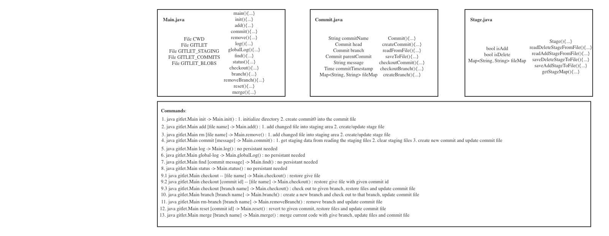

# Gitlet Design Document
author: Qiongwen Liu

## 1. Classes and Data Structures

### 1.1 Main.java
This class is the entry point of the program. It implements methods to set up persistance and support each command of the program.

#### Fields

1) static final File CWD: A pointer to the current working directory of the program.
2) static final File GITLET: A pointer to the `.gitlet` directory in the current working directory.
3) static final File GITLET_STAGING: A pointer to the `.gitlet/stagingarea` directory in the current working directory.
4) static final File GITLET_COMMITS: A pointer to the `.gitlet/commits` directory in the current working directory.
5) static final File GITLET_BLOBS: A pointer to the `gitlat/blobs` directory in the current working directory.

### 1.2 gitlet.Commit.java

This class is mainly focus on the commit related fields and operations. It will arrange all the commit
so far we have and mange branches we have in the gitlet system and so on.

#### Fields

1) String commitName: identify a particular commit by using SHA.
2) gitlet.Commit head: A pointer points to the current commit.
3) gitlet.Commit branch: A pointer points to the current branch name.
4) gitlet.Commit parentCommit: A commit pointer that points to its parent commit.
5) String message: gitlet.Commit message.
6) Time commitTimestamp: The timestamp when the commit happens.
7) Map<String, String> fileMap: A filename-sha pair that store all the commit related files with there content.

### 1.3 Stage.java

This class is to store all the staging information for both stage for addtion and stage for deletion. 

#### Fields

1) bool isAdd: true if it's the stage for addition, false otherwise.
2) bool isDelete: true if it's the stage for deletion, false otherwise.
3) Map<String, String> fileMap: A filename-sha pair that store all the staging related files with there content.

## 2. Algorithms

### 2.1 Main.java

1) main(): This is the entry point of the program. It will check on the input format and see if that obey our rules, if not throw an error.
2) init(): When user input init command, main function will call on this init() function for `.gitlet` initialization. It will create all the related `.gitlet` folders and sub-folders. After creating the folders, it will initial commit0 and persist it.
3) add(): When user input add command, main function will call on this add() function for new files addition. This function will handle the stage map (filename-sha pairs), create a new file in the blobs if need, and persist the stage entity.
4) commit(): When user input commit command, main function will call on this commit() function and create a new commit based on the existing files in the staging area(for addition or deletion).
5) remove(): Opposite to add() function, when user input rm command, we will add records into the stagingMap wait for later commitment.
6) log(): When user input log command, main function will call on this log() function and starting at the current head commit, display information about each commit backwards along the commit tree until initial commit.
7) globalLog(): Similar to log() function, except displays information about all commits ever made. The order of the commits does not matter.
8) find(): When user input find command, main function will call on this find() function and prints out the ids(names) of all the commits that have the given commit message.
9) status(): When user input status command, main function will call of this status() function and displays when branches currently exist, and marks the current branch with *. Also display what files have been staged for addition or removal.
10) checkout():  When user input checkout command, there are three possible checkout options: (1) filename (2) filename with commit id (3) branch name
11) branch(): When user input branch command, main function will call on this function and create a new branch with the given name.
12) removeBranch(): When user input rm-branch command, system will delete the branch with the given branch name.
13) reset(): When user input reset command, system will get reset to the give commit id and change the status and related files.
14) merge(): When user input merge command, system will merge the target branch onto the current branch, check in any differences and mark the conflict files with certain format.

### 2.2 gitlet.Commit.java

1) gitlet.Commit(): Constructor function, it will create an instance of the gitlet.Commit class.
2) createCommit(): Create a new commit with given commit message, generate sha id for itself and get all file related information from stagingMap.
3) readFromFile(): Read commit instance from file.
4) saveToFile(): Save commit instance to file.
5) checkoutCommit(): Check out a commit in the commit tree within current branch and restore the status and files.
6) checkoutBranch(): Check out to another branch.
7) createBranch(): create a new branch and checkout to that branch, will call checkoutBranch() function.

### 2.3 Stage.java

1) Stage(): Constructor function, it will create an instance of the Stage class.
2) readDeleteStageFromFile(): Read stage for deletion entity from file.
3) readAddStageFromFile(): Read stage for addition entity from file.
4) saveDeleteStageToFile(): Save delete stage entity to file.
5) saveAddStageToFile(): Save add stage entity to file.
6) getStageMap(): Get current staging map.

## 3. Persistence

### 3.1 init
- When user try to init the repository, system will initalize all of the `.gitlet` related directory if not exist. And creating a new commit file in the sub folder to store the first auto created commit0. 

### 3.2 add
- When user try to add files, system will generate a stagingMap based on the current status and save it to a file. If already exist one, read content from it and append to it.

### 3.3 remove
- Similar to add, but this time system will generate a stagingMap and save to delete stage file.

### 3.4 gitlet.Commit
- When user try to commit, system will read the stagingMap from both add and delete stage, 
- Clear these files and create a new commit with the staging information, point to the current commit as its parent and save to the commit file.

### 3.5 Checkout
- If it is checking out to a file, find the latest change to that file and restore it to the current commit.
- If it is checking out to a file with particular commit id, then do the save above.
- If it is checking out to a branch, switch the branch in commit and save it back.

### 3.6 Branch:
- When user try to create a new branch, add additional branch pointer to the commit and save it back.

### 3.7 Remove Branch:
- Opposite to the create branch, remove the branch pointer and save it back to the file.

### 3.8 Reset:
- Revert commit to the give commit id and save back to the file.

### 3.9 Merge:
- Merge the target branch with current branch, create a new commit for the merging result and save it back to the commit file.

## 4. Design Diagram

